### ESTADO EN DESAROLLO.

# Proyecto de DJANGO: Aplicacion portable pomodoro.

## Descripcion del proyecto:

Es una aplicacion de escritorio desarollada con un backend de DJANGO y un frontend de Vue.
La aplicacion tiene por tematica, el mundo de pokemon y su objetivo es ayudar a los usuarios a mejorar su productividad utilizando la tecnica pomodoro, que consiste en trabajar durante 25 minutos y luego tomar un descanso de 5 minutos.
Para ello, cada vez que se cumpla una tarea o el usuario complete un ciclo, sus pokemones subiran de nivel.

## Tecnologias utilizadas:

- DJANGO: Framework de desarrollo web en Python.
- Vue: Framework de JavaScript para construir interfaces de usuario.
- SQLite: Base de datos ligera y fácil de usar.
- HTML/CSS: Para el diseño y la estructura de la aplicacion.
- JavaScript: Para la logica del frontend.
- PyInstaller: Para convertir la aplicacion en un ejecutable portable. (En desarrollo)
- Docker: Para contenerizar la aplicacion y facilitar su despliegue. (En desarrollo)

## Instalacion y uso:

1. Clonar el repositorio:
```bash
git clone
```
2. Navegar al directorio del proyecto:
```bash
cd Poketimmer/Poketimmer-APP
```
#### Recomendacion usar un entorno virtual para instalar las dependencias de Python:
```bash
python -m venv env
source env/bin/activate  # En Windows: env\Scripts\activate
```
3. Instalar las dependencias de Python:
```bash
pip install -r requirements.txt
```
4. Navegar al directorio del frontend y instalar las dependencias de JavaScript:
```bash
cd frontend
npm install
```

5. Volver al directorio raiz y ejecutar las migraciones de Django:

```bash
cd ..
python manage.py migrate
```
6. Cargar la base de datos de pokemon con el script de carga:
```bash
python manage.py cargar_kanto
```
7. Ejecutar el servidor de desarrollo de Django:
```bash
python manage.py runserver
```
8. En otra terminal, navegar al directorio del frontend y ejecutar el servidor de desarrollo de Vue:
```bash
cd frontend
npm run serve
```
9. Abrir el navegador y acceder a `http://localhost:5173` para ver la aplicacion en funcionamiento. 

Optional: Si quieres ver la version electron de la aplicacion, puedes ejecutar el siguiente comando en el directorio del frontend, luego de ejecutar los anteriores pasos para iniciar el backend y el frontend:
```bash
npm run electron:serve
```

## Capturas de pantalla:

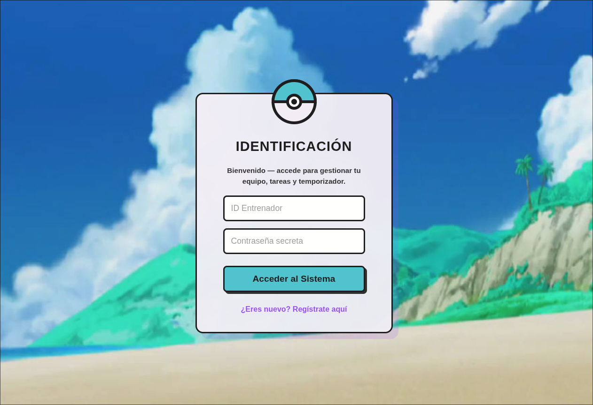
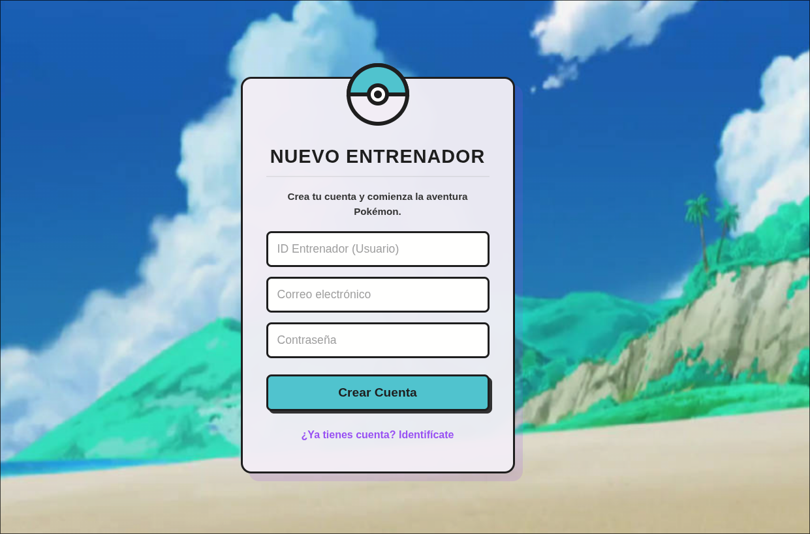
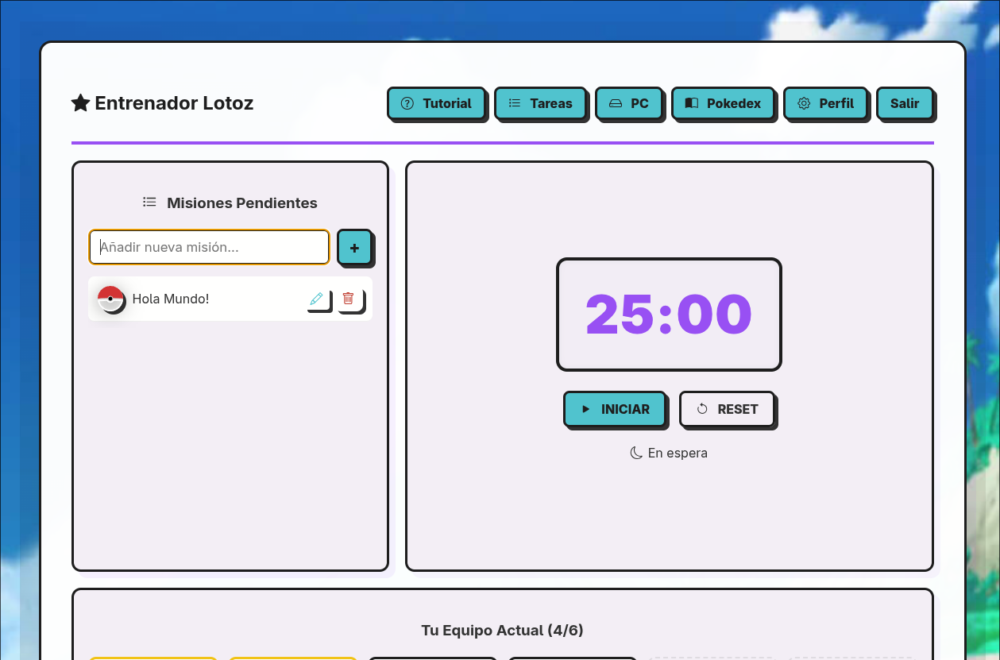
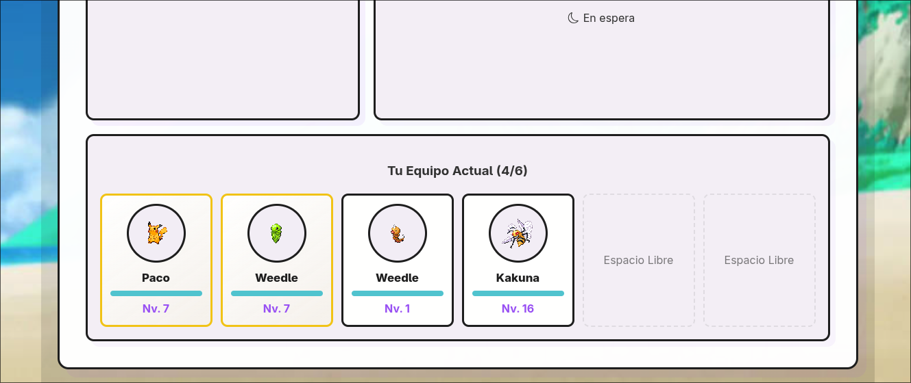
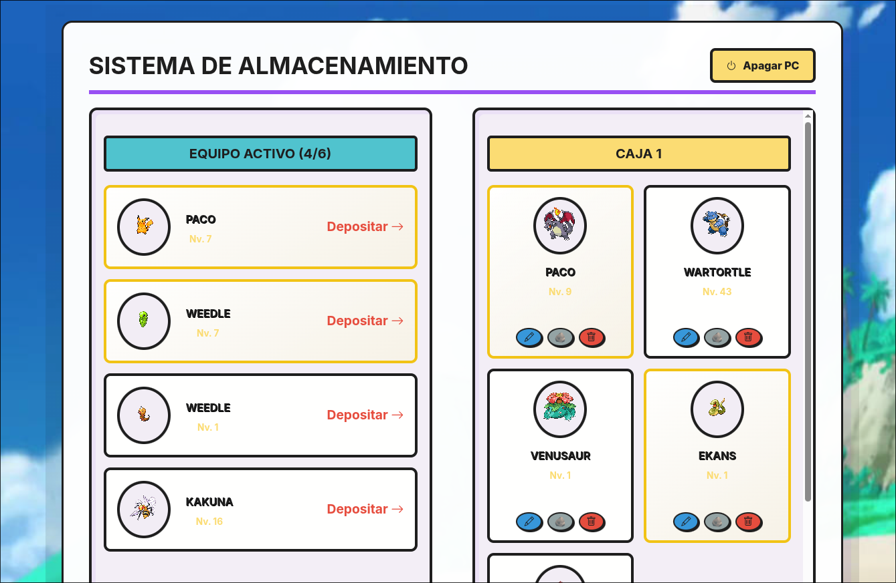
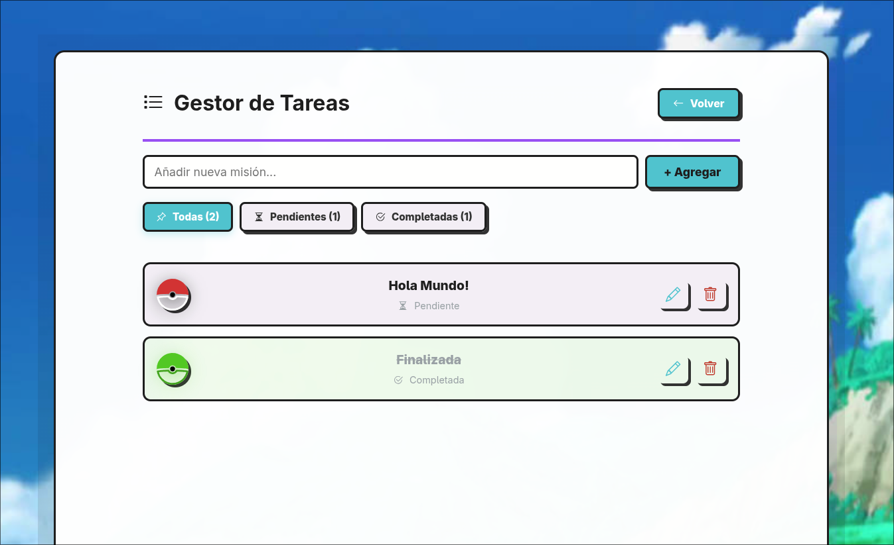
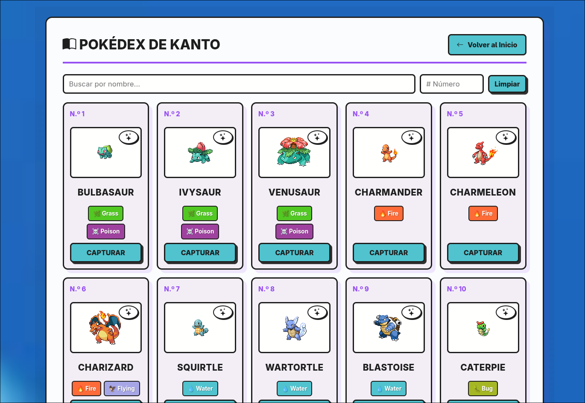
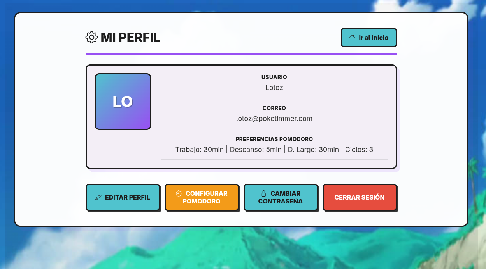
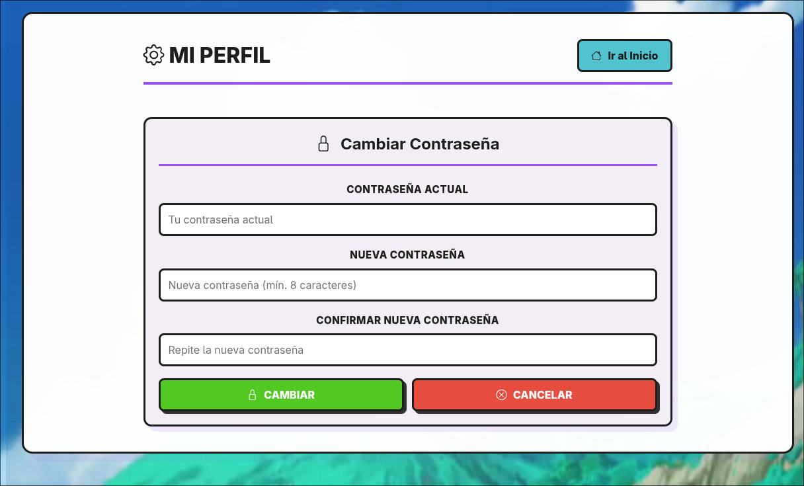
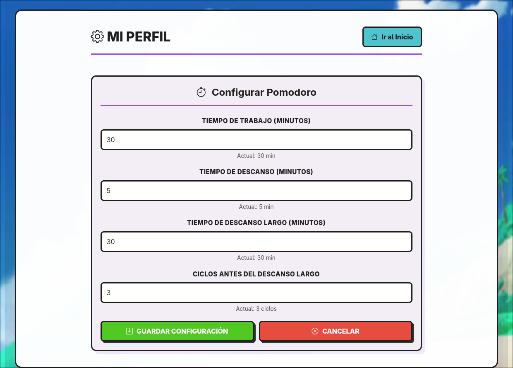
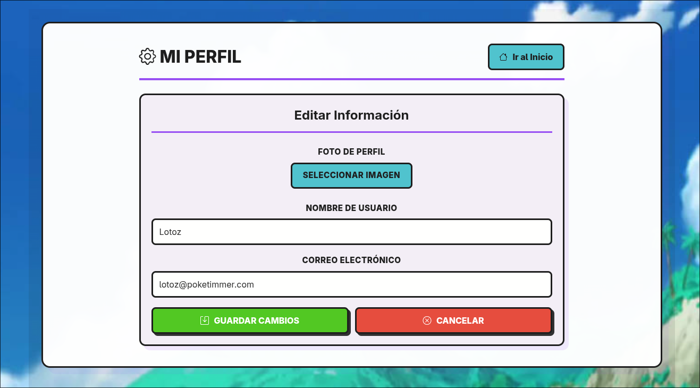
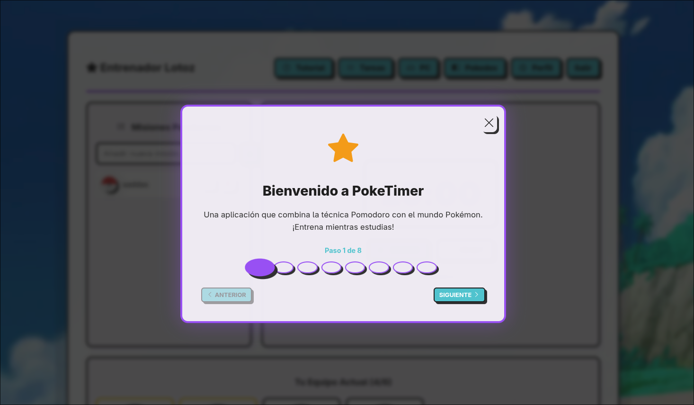

## Estructura del proyecto:

```txt
📦Poketimmer
 ┣ 📂api
 ┃ ┣ 📂management
 ┃ ┃ ┗ 📂commands
 ┃ ┃ ┃ ┗ 📜cargar_kanto.py
 ┃ ┣ 📂migrations
 ┃ ┃ ┣ 📜0001_initial.py
 ┃ ┃ ┣ 📜0002_alter_pokedexentry_sprite_url.py
 ┃ ┃ ┣ 📜0003_pokedexentry_evolucion_siguiente_and_more.py
 ┃ ┃ ┣ 📜0004_pokedexentry_tipo_secundario.py
 ┃ ┃ ┗ 📜0005_pokedexentry_sprite_shiny_url_and_more.py
 ┃ ┣ 📜admin.py
 ┃ ┣ 📜apps.py
 ┃ ┣ 📜models.py
 ┃ ┣ 📜serializers.py
 ┃ ┣ 📜urls.py
 ┃ ┗ 📜views.py
 ┣ 📂backend
 ┃ ┣ 📜asgi.py
 ┃ ┣ 📜settings.py
 ┃ ┣ 📜urls.py
 ┃ ┗ 📜wsgi.py
 ┣ 📂frontend
 ┃ ┣ 📂electron
 ┃ ┃ ┗ 📜main.cjs
 ┃ ┣ 📂public
 ┃ ┃ ┗ 📂pokemon
 ┃ ┃ ┣ 📂normal
 ┃ ┃ ┃ ┗ 📜 ... (151 pokemon sprites)
 ┃ ┃ ┣ 📂shiny
 ┃ ┃ ┃ ┗ 📜 ... (151 shiny pokemon sprites)
 ┃ ┃ ┗ 📜alola.jpg
 ┃ ┃ ┗ 📜vite.svg
 ┃ ┣ 📂src
 ┃ ┃ ┣ 📂api
 ┃ ┃ ┃ ┗ 📜axios.js
 ┃ ┃ ┣ 📂assets
 ┃ ┃ ┃ ┗ 📜vue.svg
 ┃ ┃ ┣ 📂components
 ┃ ┃ ┃ ┣ 📜EquipoPokemon.vue
 ┃ ┃ ┃ ┣ 📜ListaTareas.vue
 ┃ ┃ ┃ ┗ 📜PomodoroTimer.vue
 ┃ ┃ ┣ 📂utils
 ┃ ┃ ┃ ┗ 📜prettyAlert.js
 ┃ ┃ ┣ 📂views
 ┃ ┃ ┃ ┣ 📜DashboardView.vue
 ┃ ┃ ┃ ┣ 📜LoginView.vue
 ┃ ┃ ┃ ┣ 📜PCView.vue
 ┃ ┃ ┃ ┣ 📜PokedexView.vue
 ┃ ┃ ┃ ┣ 📜ProfileView.vue
 ┃ ┃ ┃ ┗ 📜RegistroView.vue
 ┃ ┃ ┣ 📜App.vue
 ┃ ┃ ┣ 📜main.js
 ┃ ┃ ┣ 📜router.js
 ┃ ┃ ┗ 📜style.css
 ┃ ┣ 📜index.html
 ┃ ┣ 📜package.json
 ┃ ┗ 📜vite.config.js
 ┣ 📂media
 ┃ ┗ 📂profile(fotos de perfil)
 ┣ 📜.env.example
 ┣ 📜db.sqlite3
 ┣ 📜manage.py
 ┣ 📜pokedex.json
 ┗ 📜requirements.txt
```

## Este proyecto esta en desarrollo, por lo que se planea agregar nuevas funcionalidades y mejoras en el futuro, como la version electron de la aplicacion y la contenerizacion con Docker. Cualquier contribucion es bienvenida!
