# ⏱️ Poketimmer: Pomodoro App


**Poketimmer** es una aplicación de escritorio diseñada para transformar la productividad en una aventura. Utilizando la **Técnica Pomodoro**, los usuarios pueden gestionar sus ciclos de trabajo y descanso mientras coleccionan y suben de nivel a sus Pokémon.

---

## 🚀 Características Principales

* **Ciclos Pomodoro:** Configura tiempos de trabajo (25 min) y descansos (5 min).
* **Gamificación Pokémon:** * Sube de nivel a tus Pokémon al completar tareas o ciclos de enfoque.
  * Gestión de equipo y acceso a la Pokédex.
  * Sistema de evolución y variantes *Shiny*.
* **Gestión de Tareas:** Lista integrada para organizar tus pendientes diarios.
* **Multiplataforma:** Ejecutable portable (vía PyInstaller) y soporte para entorno de escritorio con Electron.

---

## 🛠️ Tecnologías Utilizadas

| Backend | Frontend | Otros |
| :--- | :--- | :--- |
| **Django** (Python) | **Vue.js** 3 | **SQLite** (DB) |
| **Django REST Framework** | **Vite** | **Docker** (En proceso) |
| **PyInstaller** | **Electron** | **Axios** |

---

## ⚙️ Instalación y Configuración

Sigue estos pasos para levantar el entorno de desarrollo local:

### 1. Clonar y Preparar el Backend

```bash
# Clonar el repositorio
git clone [https://github.com/tu-usuario/Poketimmer.git](https://github.com/tu-usuario/Poketimmer.git)
cd Poketimmer/Poketimmer-APP

# Crear y activar entorno virtual
python -m venv env
# Windows: env\Scripts\activate | Unix: source env/bin/activate

# Instalar dependencias
pip install -r requirements.txt

# Ejecutar migraciones y cargar datos iniciales
python manage.py migrate
python manage.py cargar_kanto

# Crear usuario administrador (usado para login en la app)
python manage.py createsuperuser
```

### 2. Configurar el Frontend

```bash
cd frontend
npm install
npm run dev
```

## 🖥️ Ejecución

Para que la aplicación funcione correctamente, debes iniciar ambos servicios:

-Backend (Terminal 1):
```bash
cd Poketimmer/Poketimmer-APP
source env/bin/activate  # Activar entorno virtual
python manage.py runserver
```
-Frontend (Terminal 2):
```bash
cd Poketimmer/Poketimmer-APP/frontend
npm run dev
```
Luego, abre tu navegador y accede a `http://localhost:5173` para interactuar con Poketimmer.

-Versión Desktop (Opcional):
```bash
npm run electron:serve
```

## 📸 Galería de Capturas

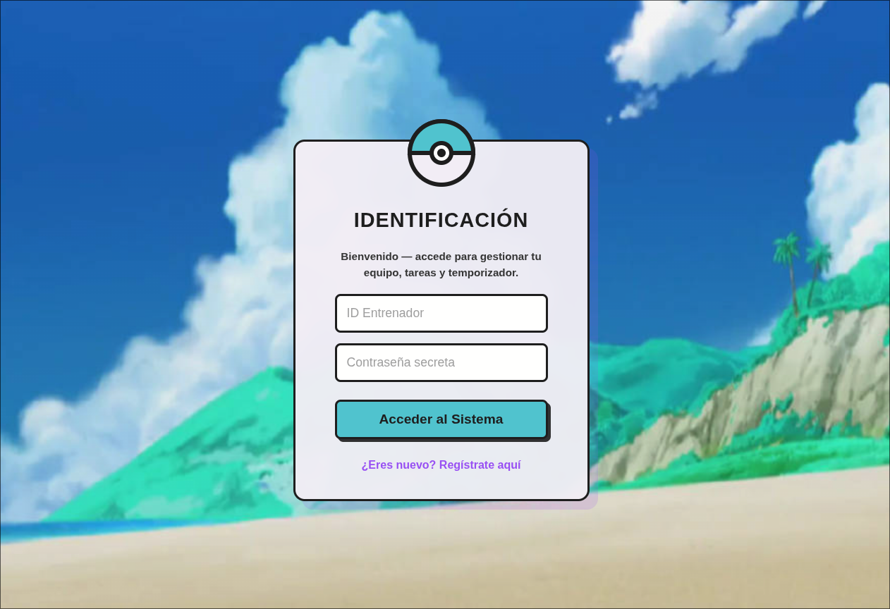
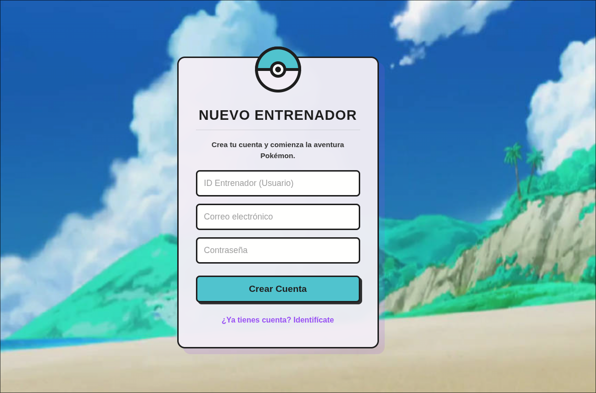
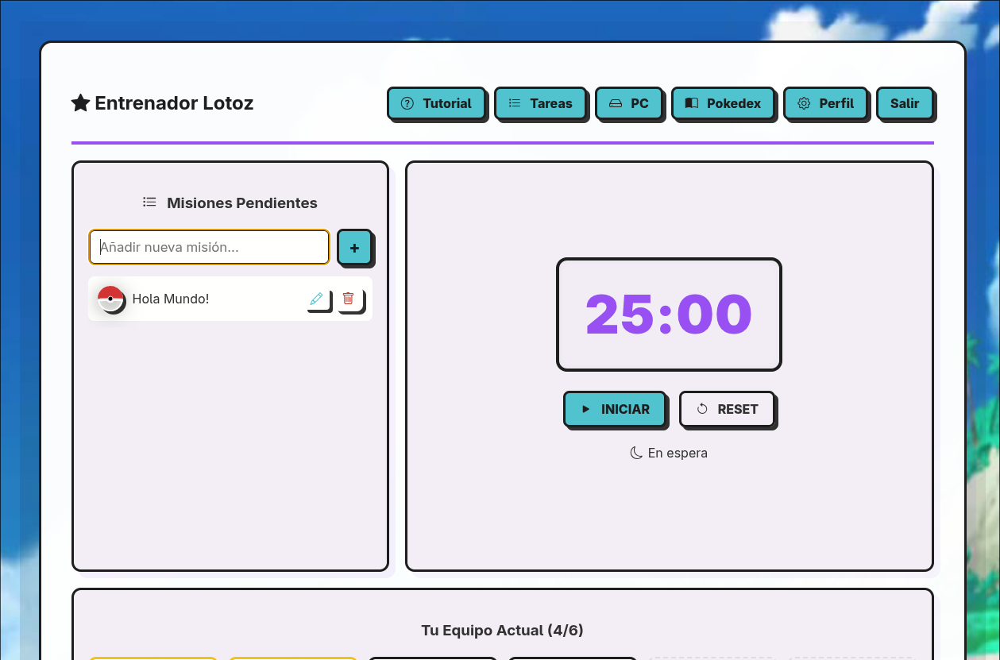
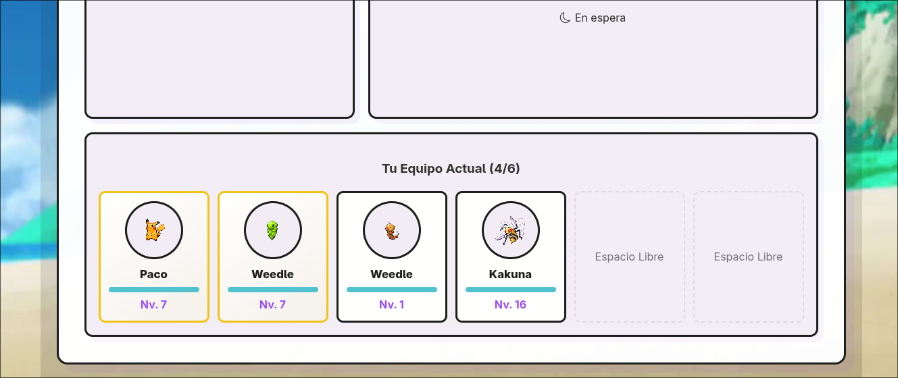
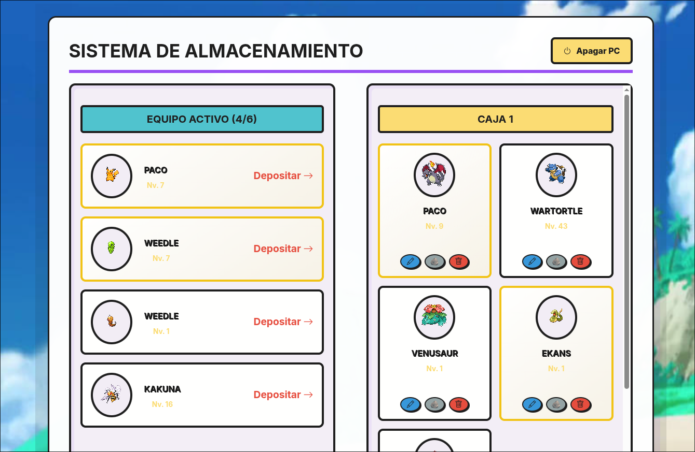
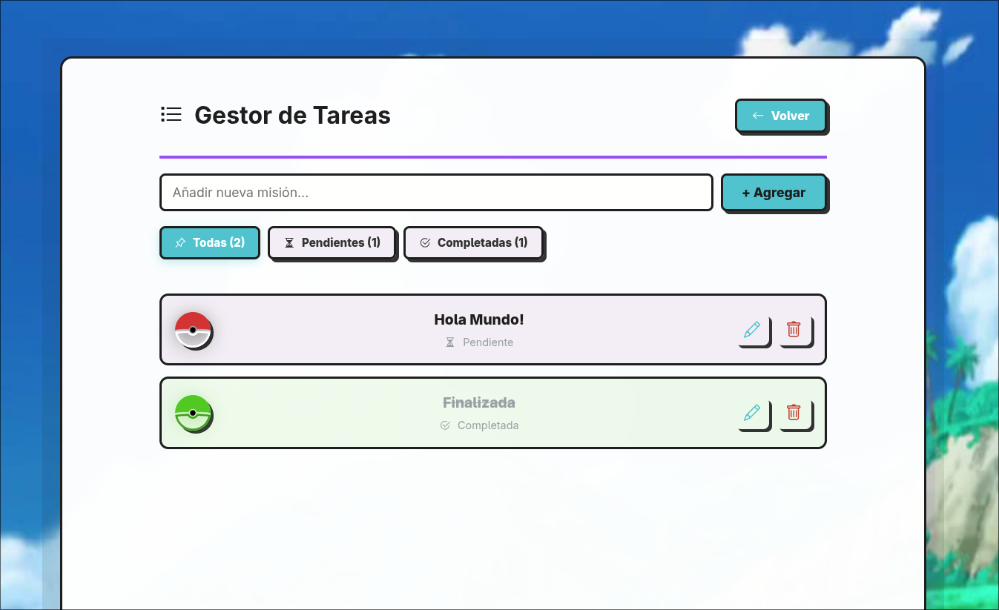
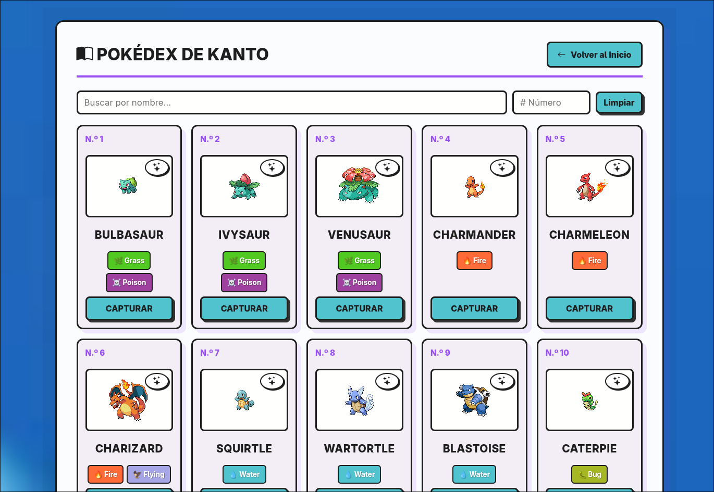
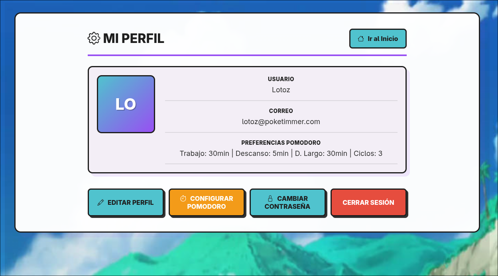
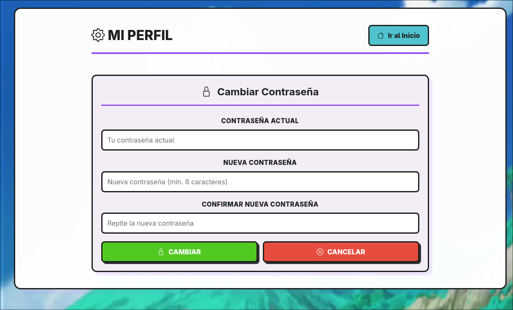
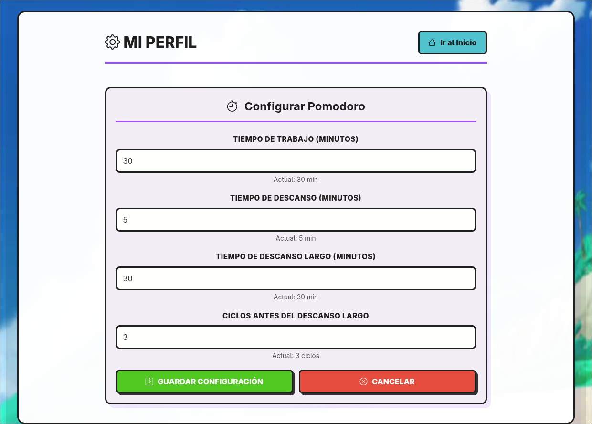
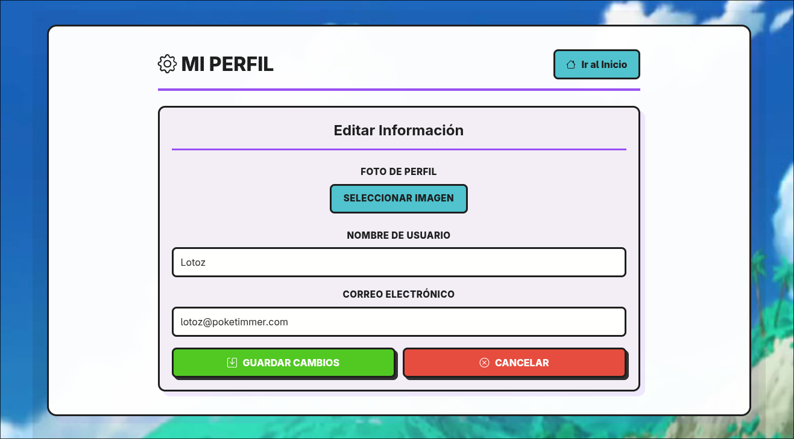
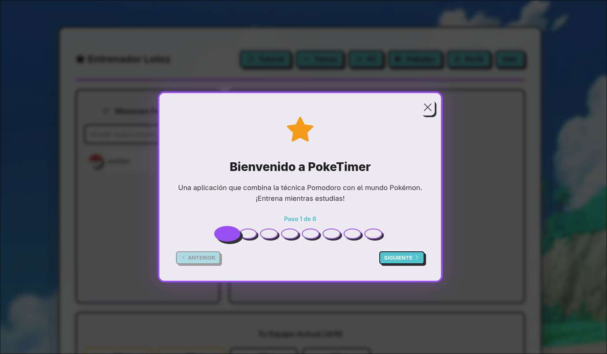

## 📂 Estructura del Proyecto
```
📦 Poketimmer
 ┣ 📂 api             # Lógica de negocio, modelos y serializadores
 ┃ ┣ 📂management    # Scripts personalizados (Carga de datos)
 ┃ ┣ 📜models.py      # Definición de Pokémon, Tareas y Usuarios
 ┃ ┗ 📜views.py       # Endpoints de la API
 ┣ 📂backend          # Configuración principal de Django
 ┣ 📂frontend         # Aplicación Vue.js 3
 ┃ ┣ 📂electron      # Configuración de App de escritorio
 ┃ ┣ 📂src
 ┃ ┃ ┣ 📂components  # Componentes reutilizables (Timer, Equipo)
 ┃ ┃ ┗ 📂views       # Vistas principales (Pokedex, Login, PC)
 ┣ 📜manage.py
 ┗ 📜requirements.txt
```

🛠️ Próximas Mejoras (Roadmap)

    [ ] Finalizar la contenerización con Docker.

    [ ] Optimizar el ejecutable con PyInstaller.

    [ ] Implementar notificaciones de escritorio al finalizar ciclos.

    [ ] Añadir sonidos clásicos de la franquicia.

    [ ] Integrar más regiones y Pokémon en futuras actualizaciones.

Desarrollado con ❤️ para entrenadores productivos.
